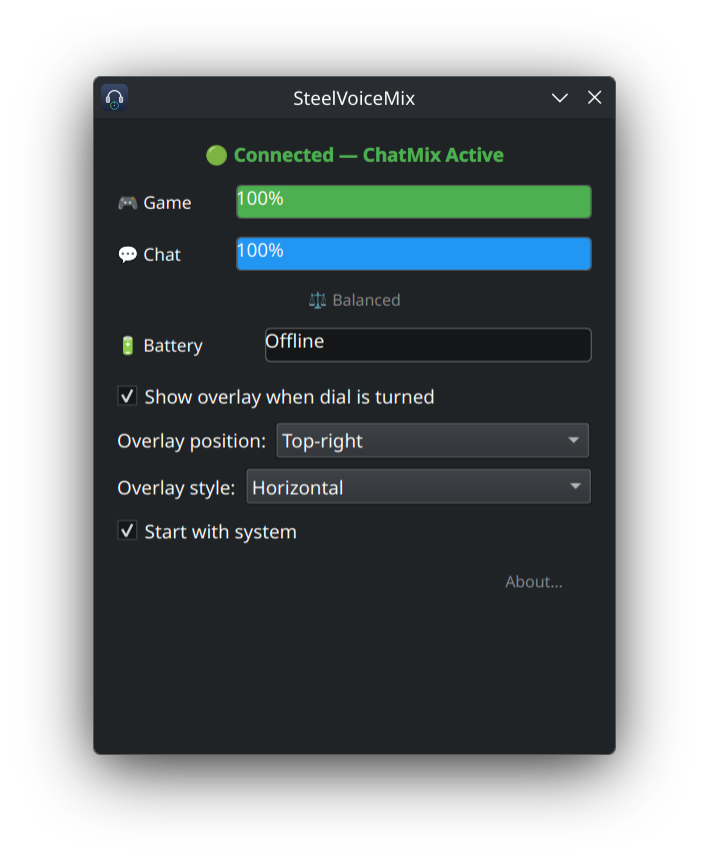

# SteelVoiceMix 🎧

Linux ChatMix implementation for the **SteelSeries Arctis Nova Pro Wireless**. Uses PipeWire virtual sinks controlled by the hardware dial on the base station.

Replaces the ChatMix functionality of SteelSeries Sonar (Windows-only) on Linux.

## Screenshots

<p>
  
</p>
<p>
  
</p>

## Debug Mode

Run the installer with verbose output to troubleshoot issues:

```bash
DEBUG=1 ./install.sh
# or
./install.sh --debug
```

## Features

- 🎮 **ChatMix dial support** — physical dial controls Game/Chat audio balance
- 🔊 **PipeWire virtual sinks** — creates NovaGame and NovaChat sinks automatically
- 🔋 **Battery monitoring** — polls battery level and charging status
- 🔌 **Plug and play** — auto-detects the base station, auto-reconnects with exponential backoff
- 🖥️ **KDE/GNOME compatible** — sinks appear in system audio settings
- 🐧 **Systemd service** — runs on boot, no manual startup needed
- 🖼️ **Optional GUI** — PySide6 system tray app with overlay, battery display

## Architecture

The project is split into two parts:

1. **Rust daemon** (`steelvoicemix`) — handles HID communication, creates PipeWire sinks, reads the ChatMix dial, adjusts volumes. Runs as a systemd user service.
2. **Python GUI** (`steelvoicemix-gui`) — optional PySide6 app that connects to the daemon over a Unix socket (`$XDG_RUNTIME_DIR/steelvoicemix.sock`) for real-time status display.

### Socket Protocol

The daemon exposes a JSON-over-Unix-socket API:

```json
// Client → Daemon
{"cmd": "subscribe"}     // Stream all events
{"cmd": "status"}        // One-shot status query

// Daemon → Client (events)
{"event": "chatmix", "game": 80, "chat": 60}
{"event": "battery", "level": 75, "status": "active"}
{"event": "connected"}
{"event": "disconnected"}
{"event": "status", "connected": true, "game_vol": 80, "chat_vol": 60, "battery": {"level": 75, "status": "active"}}
```

## How It Works

The Arctis Nova Pro Wireless base station communicates via USB HID. This tool:

1. Sends HID commands to enable ChatMix mode on the base station
2. Creates two virtual PipeWire sinks (Game + Chat) via `pw-loopback`
3. Listens for dial position changes and adjusts sink volumes in real-time via `pactl`
4. Polls battery status every 60 seconds

Route your game audio to **NovaGame** and Discord/comms to **NovaChat** — the dial does the rest.

## Requirements

- SteelSeries Arctis Nova Pro Wireless (base station connected via USB)
- PipeWire (default on Fedora 34+, Ubuntu 22.10+)
- Rust toolchain (for building)
- `pactl`, `pw-loopback`, `hidapi`

## Installation

### Build Dependencies

```bash
# Fedora
sudo dnf install cargo hidapi-devel pulseaudio-utils libnotify

# Ubuntu/Debian
sudo apt install cargo libhidapi-dev pulseaudio-utils libnotify-bin
```

### Quick Install

```bash
git clone https://github.com/Ibrahim-Aldhaheri/SteelVoiceMix.git
cd SteelVoiceMix
./install.sh
```

The install script will:
1. Check runtime dependencies (fails if `pw-loopback` is missing)
2. Build the Rust binary with `cargo build --release`
3. Install udev rules for non-root HID access
4. Install the binary to `~/.local/bin/`
5. Enable the systemd user service

### Manual Install

```bash
cargo build --release

# udev rules
sudo cp 50-nova-pro-wireless.rules /etc/udev/rules.d/
sudo udevadm control --reload-rules && sudo udevadm trigger

# Binary
cp target/release/steelvoicemix ~/.local/bin/

# Systemd service
mkdir -p ~/.config/systemd/user
cp steelvoicemix.service ~/.config/systemd/user/
systemctl --user daemon-reload
systemctl --user enable steelvoicemix --now
```

## Usage

```bash
# Headless daemon (default)
steelvoicemix

# Disable desktop notifications
steelvoicemix --no-notify

# Disable Unix socket (no GUI support)
steelvoicemix --no-socket

# Launch GUI (requires PySide6, daemon must be running)
steelvoicemix-gui

# Check service status
systemctl --user status steelvoicemix

# View logs
journalctl --user -u steelvoicemix -f
```

Once running, two new audio sinks appear:
- **NovaGame** — route games, music, browser here
- **NovaChat** — route Discord, TeamSpeak, etc. here

The physical dial on the base station controls the balance between them.

### GUI

The GUI (`steelvoicemix-gui`) connects to the running daemon and shows:
- Connection status (connected/disconnected)
- Game and Chat volume bars (updated in real-time)
- Battery level and charging status
- Dial position indicator (Game-heavy, Chat-heavy, or Balanced)
- Floating overlay on dial turn

The window minimizes to the system tray.

**Extra dependency for GUI:**
```bash
sudo dnf install python3-pyside6   # Fedora/KDE
pip install PySide6                 # pip
```

## Uninstall

```bash
./uninstall.sh
```

## Disclaimer

⚠️ **USE AT YOUR OWN RISK.** This project has no association with SteelSeries. The author is not responsible for any damage to your hardware, bricked devices, or voided warranties. If your base station starts playing elevator music on its own, that's between you and the universe.

🧪 **Tested on Fedora KDE only.** Other distributions and desktop environments may work but haven't been verified. If you run it elsewhere and hit problems, please open an issue with your setup details.

## Acknowledgments

Inspired by [nova-chatmix-linux](https://github.com/Dymstro/nova-chatmix-linux) by Dymstro, who reverse-engineered the Arctis Nova Pro Wireless USB HID protocol.

## License

[MIT](LICENSE)
